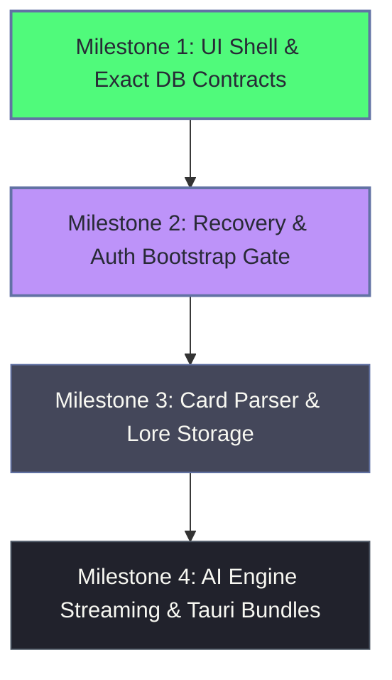

# RisuAI Leptos Frontend (Rust WASM)

Next-generation cross-platform WebAssembly frontend for RisuAI built with [Leptos](https://leptos.dev/) (CSR mode) and Rust. Designed from the ground up for high responsiveness, eliminating heavy client-side JavaScript frameworks (using minimal Trunk/wasm-bindgen JS glue), and adhering to strict memory budgeting for resource-constrained mobile and desktop environments.

---

## 1. Prerequisites & Tooling

- **Rust Toolchain**: 1.80+ with `wasm32-unknown-unknown` target
  ```bash
  rustup target add wasm32-unknown-unknown
  ```
- **Trunk**: WASM web application bundler for Rust
  ```bash
  cargo install --locked trunk
  ```

---

## 2. Development & Building

### Running the Development Server
```bash
# Inside /leptos directory
trunk serve
```
The dev server runs at `http://127.0.0.1:8080` with hot-reloading enabled.

### Building for Production
```bash
trunk build --release
```
Optimized static artifacts (`index.html`, WASM binary, JS glue, and stylesheets) are generated in the `dist/` directory.

---

## 3. Backend Proxy Configuration

Trunk development server automatically proxies API requests to the local RisuAI Rust backend server via rules in `Trunk.toml`:

```toml
[[proxy]]
rewrite = "/api"
backend = "http://127.0.0.1:6001/api"

[[proxy]]
rewrite = "/proxy"
backend = "http://127.0.0.1:6001/proxy"
```

To run against the local Rust server:
```bash
# From workspace root
cargo run -p risuai-server -- --port 6001
```

---

## 4. Milestone Boundaries

### Milestone 1: Core Shell & Database V2 Contract Alignment (Completed)
- **CSR UI Shell & Layout**: Reactive sidebar, header, mobile bottom navigation, toast feedback, and modal system.
- **Dynamic Theming Engine**: Seven classic RisuAI themes (Dracula default, Dark, Light, Cherry, Galaxy, Ocean, RealBlack) synced with CSS custom properties.
- **Backend Health Diagnostics**: Live inspection of `/api/health` and database vendor storage status.
- **Character Catalog**:
  - Exact contract alignment with `/api/database-v2/characters/search?q=...`.
  - Deserializes backend `{ "characters": [...] }` envelope with fixed 50-character limit.
  - Search input with explicit submit and enter-key triggering (no unthrottled per-keystroke requests).
  - Genuine empty state without synthetic demo entries.
- **Paginated Chat Interface & Scaffold**:
  - Canonical RisuAI message model (`role: "user" | "char"`, `data: String`).
  - Chat message paging API client and serde contracts implemented for `/api/database-v2/chats/{id}/messages` utilizing `risuai_core::pagination::PaginatedMessagesResponse<T>`.

### Milestone 2: Recovery & Auth Bootstrap Gate (Completed)
- **Application Bootstrap Gate**:
  - Unauthenticated gate evaluated before `AppLayout` and routes are mounted.
  - Queries `/api/health` and `/api/test_auth` without triggering storage-dependent routes.
  - State machine transitions cleanly across `Checking`, `Offline`, `NeedSetPassword`, `NeedLogin`, `NeedDatabaseRecovery`, and `Ready`.
- **Session-Memory Credential Architecture**:
  - Pure in-memory credential management (`AuthCredential::Password`).
  - Zero token or raw password leakage to `localStorage` or `sessionStorage`.
  - Custom `fmt::Debug` implementations for `AuthCredential`, `AuthState`, and `ApiClient` redacting all credentials.
- **Master Password Lifecycle**:
  - Setup screen for initial server initialization (`POST /api/set_password`).
  - Master password login screen (`POST /api/login`).
  - Password fields default to obscured with accessible show/hide visibility toggles.
- **Typed Database Recovery Interface**:
  - Masked server configuration inspection via `GET /api/db-config`.
  - Connectivity testing via `POST /api/db-config/test` with real-time latency reporting.
  - Update and save workflow via `POST /api/db-config` (masked passwords are never prefilled or recycled into save payloads).
  - Server-side retry workflow via `POST /api/db-config/retry`.
  - Auto-entry into main app once storage is verified as `ready` on `/api/health`.
- **Offline & Error Resilience**:
  - Dedicated offline retry screen with optional custom backend endpoint configuration.

### Milestone 3: Card Parser & Local Storage (Upcoming)
- In-browser parsing of `.png` (tEXt chunks) and `.charx` character cards in pure WebAssembly.
- Offline asset caching and image thumbnail pipeline via `/api/read/{path}`.
- Character metadata and lorebook editor.

### Milestone 4: AI Inference & Platform Packaging (Future)
- Streaming chat completions with AI providers (OpenAI, Claude, Gemini, OpenRouter, local backends).
- Memory engines (HypaMemory, SupaMemory) ported to Rust.
- Tauri 2.5 desktop and Android packaging.

---

## 5. Memory & Lazy-Loading Rules

In compliance with low-memory design guidelines, the frontend is strictly optimized to run smoothly on older mobile devices with **~4GB of RAM or less**:

1. **No Monolithic Database Deserialization (`/api/database-v2/startup` Excluded)**:
   - The monolithic startup dump is never requested or deserialized into the WebAssembly heap.
   - Bootstrapping relies purely on `/api/health`, `/api/test_auth`, and recovery endpoints.
   - Catalog browsing loads only search summaries containing essential fields (`id` and `name`).
2. **Windowed Message Pagination**:
   - Chat history loads in discrete windows via `limit` and `before` query parameters.
   - Older messages are prepended on-demand rather than keeping unbounded message buffers in memory.
3. **Aggressive Context Eviction**:
   - Switching selected characters immediately flushes active message buffers from WASM memory.
4. **Controlled Network Requests**:
   - Search queries avoid keystroke-by-keystroke flooding to prevent memory thrashing on slow devices.
5. **Conservative Type Contracts**:
   - Core fields are strongly typed while unported/extended fields are deferred via raw `serde_json::Map` without overhead.

---

## 6. Migration Sequence


